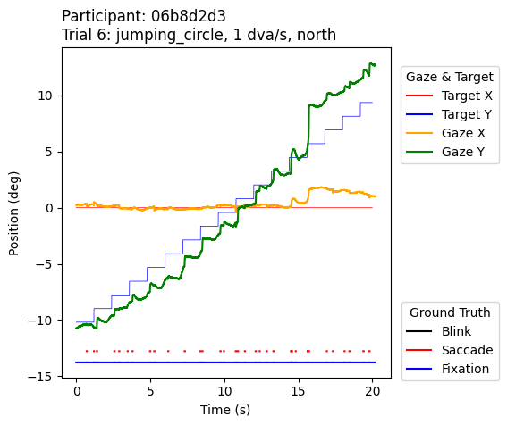

# pursuing-smooth-pursuits-data
Companion package for easy access of eye-movement benchmark data for smooth-pursuitclassification available on [OSF](https://osf.io/zx7hc/). 

## cite preprint as
Korthals, L., Visser, I., & Kucharský, Š. (2025, August 23). Eye-movement benchmark data for smooth-pursuit classification. [https://doi.org/10.31234/osf.io/qhgak_v1](https://doi.org/10.31234/osf.io/qhgak_v1)

## Installation
Make sure you have **Python (>=3.12)** and **R** installed.

Create a new environment and install this package:
```bash
conda create -n psp-data python=3.12
conda activate psp-data
pip install git+https://github.com/lukekorthals/pursuing-smooth-pursuits-data
```

## Quickstart
See the [`quickstart.ipynb`](quickstart.ipynb) notebook for a step-by-step example:
1. Download raw data from OSF.
2. Run the R cleaning script to extract relevant fields.
3. Preprocess and classify data in Python.
4. Plot and inspect results.

## Example plot
This package includes basic plotting functionality:  


## Data quality
Use the [`data_quality.ipynb`](data_quality.ipynb) notebook to compute and inspect the quality measures reported in the paper.

---

## Components

### Data Cleaning
The script [`clean_data.R`](eyemovement_data/clean_data.R) extracts relevant fields from EyeLink ASCII files into CSVs.  
It relies on the [**eyelinker** R package](https://cran.r-project.org/package=eyelinker).

### Utilities (`utils.py`)
- `download_osf_data()` – download raw data from the [OSF repository](https://osf.io/zx7hc/).  
- `clean_raw_data()` – run the R cleaning pipeline.  
- `get_participant_ids()` – return participant IDs (e.g., `06b8d2d3`) found in a data directory.

### Participant (`participant.py`)
The `Participant` class is the main entry point for analysis.

**Attributes**
- `id` (str): Participant ID, e.g., `06b8d2d3`.  
- `subset` (str): `"train"` or `"test"`, inferred from folder structure.  
- `raw_data`, `clean_data`, `preprocessed_data`, `classified_data` (dict): Store data tables as pandas DataFrames.  
- `preprocessor` (Preprocessor): Defines preprocessing steps (default: `OriginalPreprocessor`).  
- `classifier` (Classifier): Defines classification algorithm (default: `OriginalClassifier`).  

**Methods**
- `set_raw_data(path="data/raw")` – load raw CSVs.  
- `set_clean_data(path="data/clean")` – load cleaned CSVs.  
- `set_preprocessed_data(path="data/preprocessed")` – load preprocessed CSVs.  
- `set_classified_data(path="data/classified")` – load classified CSVs.  
- `preprocess_clean_data()` – preprocess `clean_data` using the chosen preprocessor.  
- `classify_preprocessed_data(trials=None)` – classify `preprocessed_data` for all or selected trials.  
- `save_data(out_path, what)` – save raw/clean/preprocessed/classified data.  
- `plot_trial(trial_number)` – create a plot for one trial.

### Preprocessor (`preprocessor.py`)
The `Preprocessor` defines how raw/clean data are transformed before classification (e.g., trimming to targets, blink masking, px→deg conversion, time alignment, velocity computation).  
The default implementation is `OriginalPreprocessor`.  

You can implement your own preprocessing protocol by subclassing `Preprocessor` and overriding its methods.

### Classifier (`classifier.py`)
The `Classifier` defines how preprocessed gaze data are segmented into events (fixations, saccades, smooth pursuits, blinks).  
The default implementation is `OriginalClassifier`, which uses a velocity-threshold approach.  

You can implement your own classification protocol by subclassing `Classifier` and providing custom event detection logic.

---

## Typical workflow
```text
download_osf_data() → clean_raw_data() → Participant(...) 
  → preprocess_clean_data() → classify_preprocessed_data() → plot_trial()
```
